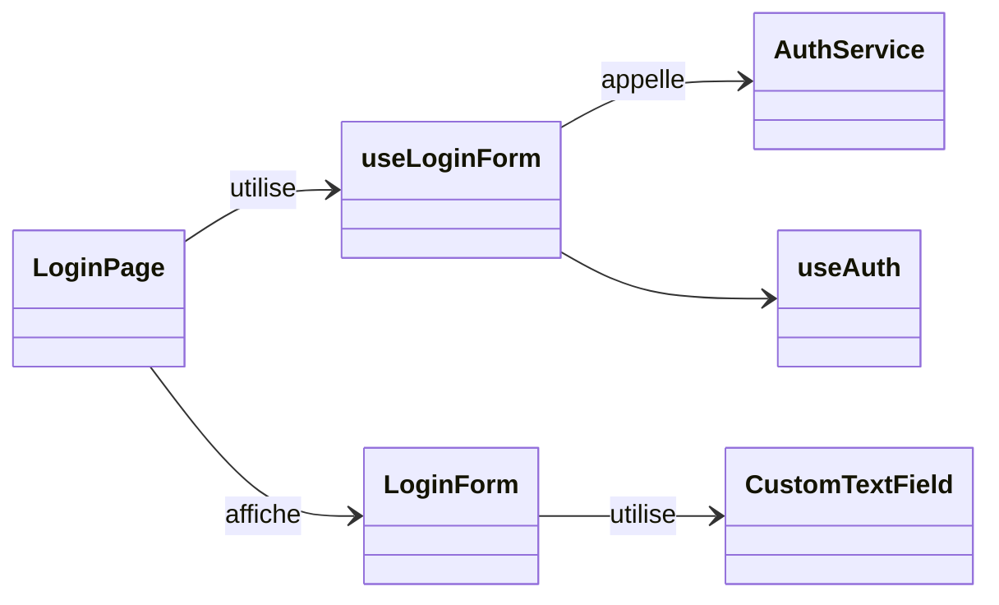
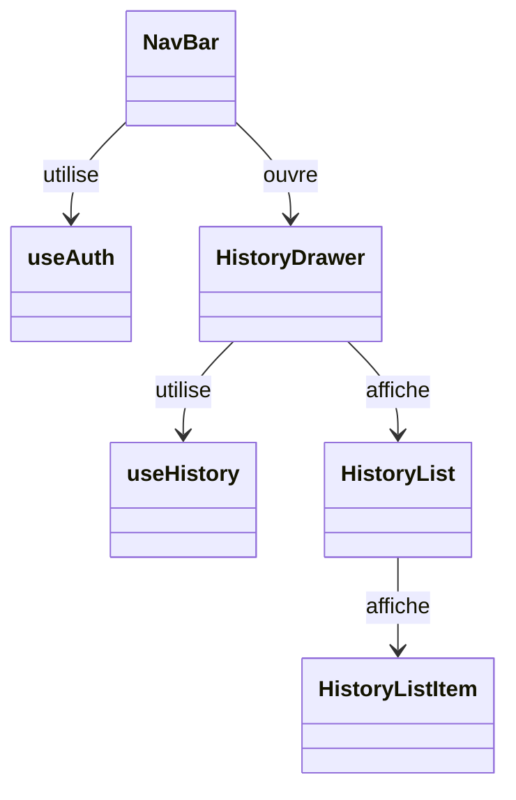
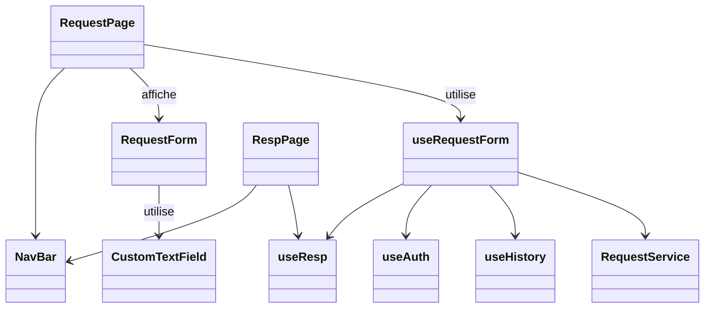

### Diagramme 1 : Le Flux d'Authentification

```mermaid
classDiagram
    direction LR

    subgraph Page
        LoginPage
    end

    subgraph Hook
        useLoginForm
    end

    subgraph Component
        LoginForm
        CustomTextField
    end

    subgraph Service
        AuthService
    end

    LoginPage --> useLoginForm : utilise
    LoginPage --> LoginForm : affiche
    LoginForm --> CustomTextField : utilise
    useLoginForm --> AuthService : appelle
    useLoginForm --> useAuth
```

### Diagramme 2 : Le Flux de l'Historique

```mermaid
classDiagram
    direction TB

    subgraph Affichage
        NavBar
        HistoryDrawer
        HistoryList
        HistoryListItem
    end

    subgraph Hooks
        useAuth
        useHistory
    end

    NavBar --> useAuth : utilise
    NavBar --> HistoryDrawer : ouvre
    HistoryDrawer --> useHistory : utilise
    HistoryDrawer --> HistoryList : affiche
    HistoryList --> HistoryListItem : affiche
```

### Diagramme 3 : Le Flux de Requête & Réponse

```mermaid
classDiagram
    direction TB

    subgraph Pages
        RequestPage
        RespPage
    end

    subgraph Composants
        NavBar
        RequestForm
        CustomTextField
    end

    subgraph Logique
        useRequestForm
        useResp
        useAuth
        useHistory
    end

    subgraph Service
        RequestService
    end

    RequestPage --> NavBar
    RequestPage --> RequestForm : affiche
    RequestForm --> CustomTextField : utilise

    RequestPage --> useRequestForm : utilise

    useRequestForm --> useResp
    useRequestForm --> useAuth
    useRequestForm --> useHistory
    useRequestForm --> RequestService

    RespPage --> NavBar
    RespPage --> useResp
```
